Features
============

``Peritia ASL``
----------------------------
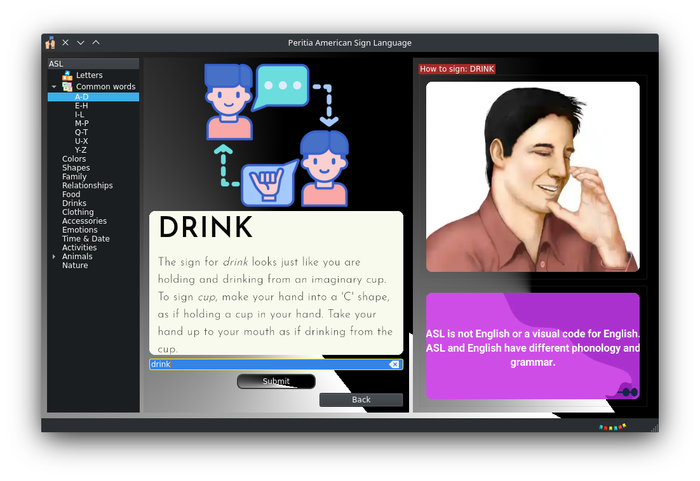

Peritia ASL is an American Sign Language catalogue program that can help individuals learn and improve their American Sign Language skills.
 It features interactive signing instructions,a finger spelling tool and a search bar to search signs by word or by browsing through categories.

``Aura``
---------
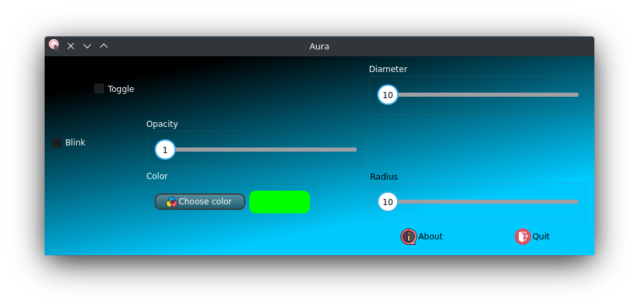

Aura is a cursor highlighting tool that is used to make the cursor more visible or distinguishable on a computer screen. 
This can be useful for individuals with visual impairments or for those using a computer in a brightly lit environment.
Aura offers various customization options such as different colors, and size.

``1 Changing Aura color``
^^^^^^^^^^^^^^^^^^^^^^^^^^^^^^^^

To change aura color, you can use the built in color dialog to select pre-defined color palettes or use the blend and gradient function to define custom colors.
This will allow you to make the cursor stand out more against the background.

``2 Changing Aura opacity``
^^^^^^^^^^^^^^^^^^^^^^^^^^^^^^^^^^^^

Changing the opacity/transparency of the Aura  can help to blend elements together, creating a more cohesive overall look. Setting a low opacity can be 
used to draw attention to certain elements on the computer screen without obscuring the view or to make certain elements appear more prominent or subtle
depending on your taste.

``3 Enabling blinking Aura``
^^^^^^^^^^^^^^^^^^^^^^^^^^^^^^^^^^
 A blinking Aura is a visual indicator used to indicate the position of the cursor and make it more noticeable.

``4 Increasing Aura size``
^^^^^^^^^^^^^^^^^^^^^^^^^^^^^^^^^^^^^^^^^^^^^^^

 This option will allow you to increase the size of Aura (radius/diameter). This can make it easier to spot on the screen.

``5 Using keyboard shortcuts.``
^^^^^^^^^^^^^^^^^^^^^^^^^^^^^^^^^^^^^^

Launch magnify using **Ctrl-A** this allows you to start Aura with ease. These shortcut can save time and make it easier to toggle and adjust  Aura settings as needed.

``BigRead``
--------------
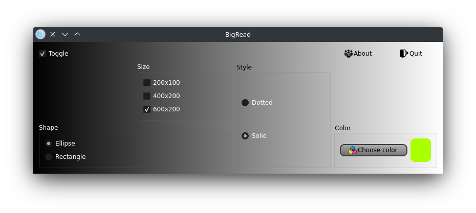

BigRead enables you to zoom in on parts of your display by magnifying the section on the screen that is near the cursor.BigRead can be particularly useful for
users with visual impairments or those who prefer larger texts and images.

``1 Changing BigRead Magnifier border color.``
^^^^^^^^^^^^^^^^^^^^^^^^^^^^^^^^^^^^^^^^^^^^^^^^^^^^^^^^

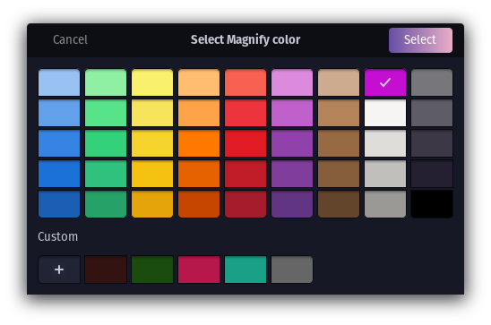

To change magnify color, you can use the built in color dialog to select pre-defined color palettes or use the blend and gradient function to define custom colors.

``2 Changing BigRead magnifier shape.``
^^^^^^^^^^^^^^^^^^^^^^^^^^^^^^^^^^^^^^^^^^^

This will make it easier to read the text and keep the content of the screen in proportion.

Available shapes are:

**Ellipse**

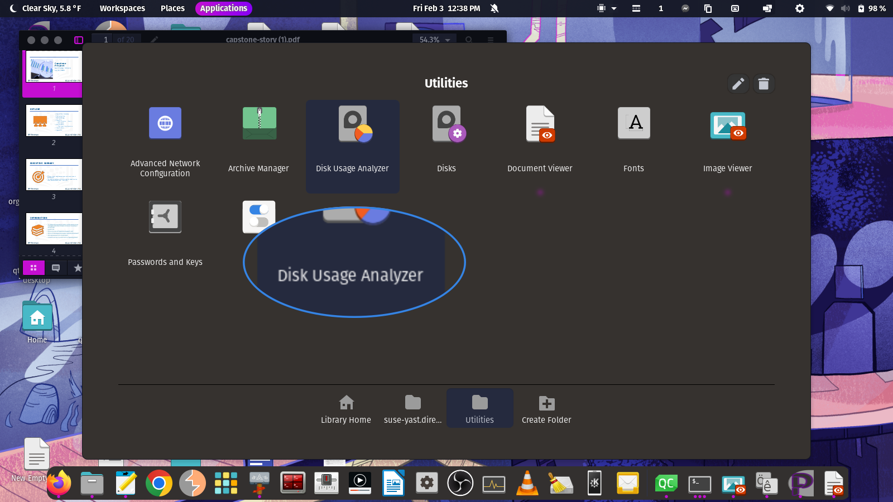

**Rectangle**

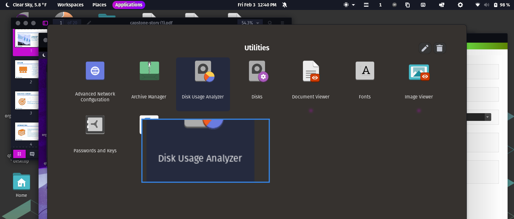

``3 Changing BigRead magnifier size.``
^^^^^^^^^^^^^^^^^^^^^^^^^^^^^^^^^^^^^^^^^^^^^^

**400x200**

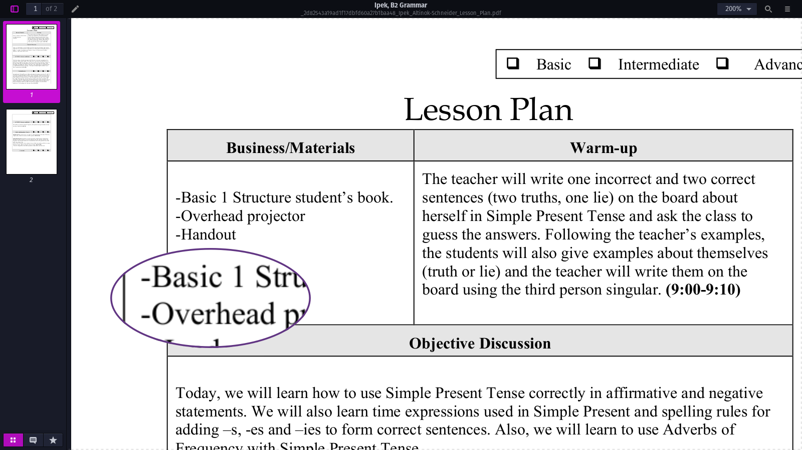

**600x200**

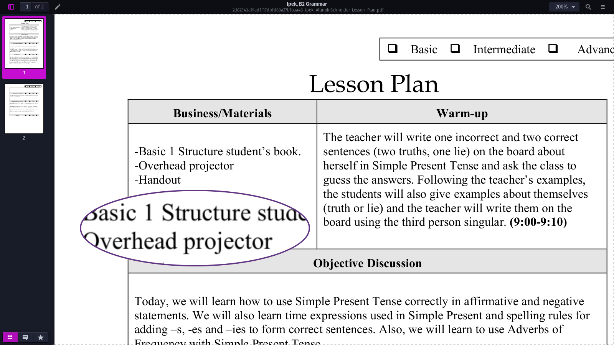

Different magnify size can have a big impact on readability, so it's important to experiment with different sizes to find the one that works best for you.

``4 Changing  BigRead magnifier style.``
^^^^^^^^^^^^^^^^^^^^^^^^^^^^^^^^^^^^^^^^^^^^

**Dotted**

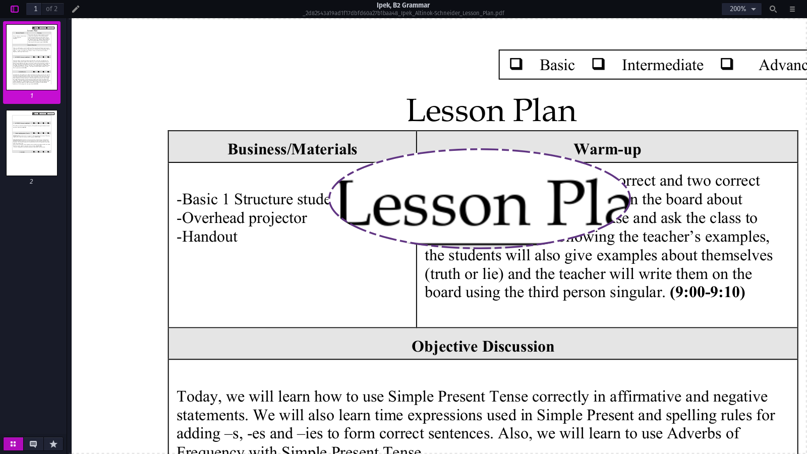

**Solid**

.. image:: ./images/magnifysolid.png

``5 Using keyboard shortcut.``
^^^^^^^^^^^^^^^^^^^^^^^^^^^^^^^^^^^

Launch magnify using **Ctrl-M** this allows you to quickly magnify text. These shortcut can save time and make it easier to toggle and adjust magnify settings as needed.

``SideKick``
---------------------

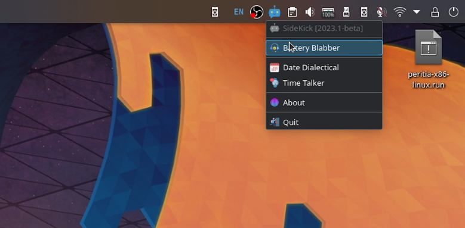

SideKick is a software designed to provide you with accurate and up-to-date verbal information about your device's battery health, charge status, and time. 
It can also track your battery health over time by analyzing your charging habits and usage patterns, and provide you with verbal insights into how to optimize your 
device's battery life and improve its overall health. Useful for individuals with visual impairments or who prefer a spoken feedback instead.

``Battery Babbler``
^^^^^^^^^^^^^^^^^^^^^^

Our robot can say the battery status by speaking the current battery percentage in a clear and concise manner, such as *"Battery level is at 75 percent."*
If the battery level is under 10 percent or critically low, the robot can say, *"Battery level is low. Please connect to a power source."*

``Date Dialectic``
^^^^^^^^^^^^^^^^^^
.. image:: ./images/date-dialectic.png
   :width: 30
   :alt: Date Dialectic icon.

Our robot can say the current date by speaking the current day, date, month and year in a clear and concise manner, such as 
*"Good morning, today is Monday, date 25, February 2024."*

``Time Talker``
^^^^^^^^^^^^^^^

Our robot can say the current time by speaking the time in a clear and concise manner, such as *"The current time is 1:45 PM."*

``Talkify``
-------------------

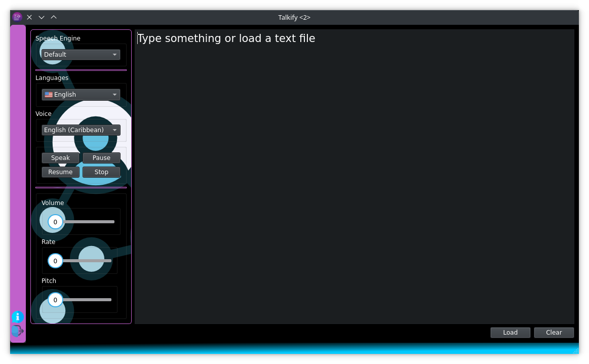

Talkify is a text to speech software  that can play written text as spoken words. Designed with people with disabilities in mind, providing a powerful tool to 
assist with reading and comprehension. 
Whether you have visual impairments, dyslexia, or any other disability that makes reading challenging, Talkify is here to help.

Talkify is incredibly versatile and can be customized to suit your individual needs. You can choose from a range of voices, speeds, and languages allowing you
to find the perfect combination that works best for you.

Features included in this software are as follows:

Multiple Voices.
^^^^^^^^^^^^^^^^^^^^
Users can select from a range of voices to suit their preferences and use cases.

Customizable Speed and Tone.
^^^^^^^^^^^^^^^^^^^^^^^^^^^^^
Users can adjust the speed and tone of the voice to make it more natural and understandable.

Multilingual Support.
^^^^^^^^^^^^^^^^^^^^^^^
Talkify can support multiple languages and accents to cater to a global audience.

Talkify can help improve literacy and comprehension by providing an alternative way to consume written material as well as allow people to consume written material while
keeping their hands free for other tasks, such as writting thus increasing productivity.

Overall, Talkify can help increase accessibility and provide new ways for people to access and engage with written information.

List of languages supported by Talkify:

    - Afrikaans
    - English
    - French
    - Hindu
    - Oromo
    - Swahili

``TextEase``
-----------------

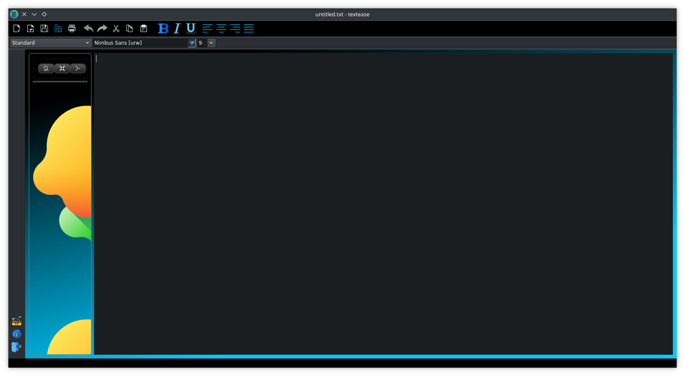

TextEase is a text editor that talks back. It allows users to write and edit text while receiving audio feedback in real-time. As the user types, the editor will
 speak out loud each character that is inputted, allowing for a more immersive writing experience. 
Additionally, TextEase may provide spoken suggestions for grammar or spelling errors, helping the user to improve their writing skills.
This can be useful for people with visual impairments, as well as for anyone who prefers an audio-based approach to writing and editing text-based content.

``KeyBoard Shortcuts``
--------------------------

Some of the advantages of using keyboard shortcuts are:

- **Increased productivity.**

Keyboard shortcuts allow you to perform actions more quickly, saving time and increasing your overall productivity. 

- **Improved efficiency**

Keyboard shortcuts can streamline repetitive tasks and reduce the time and effort required to complete them. 
For example you can easily toggle on Magnify feature using **Ctrl+M**.

- **Reduced mouse usage.**

Keyboard shortcuts can reduce the strain on your hands and wrists associated with excessive mouse usage.

- **Consistency.**

Keyboard shortcuts  provide a consistent way of performing different tasks with our software thus reducing the need to relearn tasks in different contexts. 
For example to minimize Peritia software press **Esc** button

.. list-table:: Peritia Keyboard Shortcuts.
   :widths: 25 25
   :header-rows: 1

   * - Key
   * - usefulness

