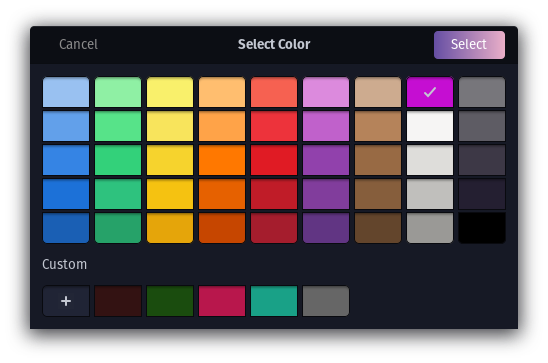

Features
============

``Aura`` 🔾
---------
Aura is a cursor highlighting tool that is used to make the cursor more visible or distinguishable on a computer screen. This can be useful for individuals with visual impairments or for those using a computer in a brightly lit environment.
Aura offers various customization options such as different colors, and size.

``1 Changing Aura color`` 🌈

 This will allow you to make the cursor stand out more against the background.

``2 Increasing Aura size`` ♎
 This option will allow you to increase the size of Aura (radius/diameter). This can make it easier to spot on the screen.

``3 Changing Aura opacity`` 
 Changing the opacity/transparency of the Aura  can help to blend elements together, creating a more cohesive overall look. Setting a low opacity can be used to draw attention to certain elements on the computer screen without obscuring the view or 
 to make certain elements appear more prominent or subtle depending on your taste.

``4 Enabling blinking Aura``
 A blinking Aura is a visual indicator used to indicate the position of the cursor and make it more noticeable.

