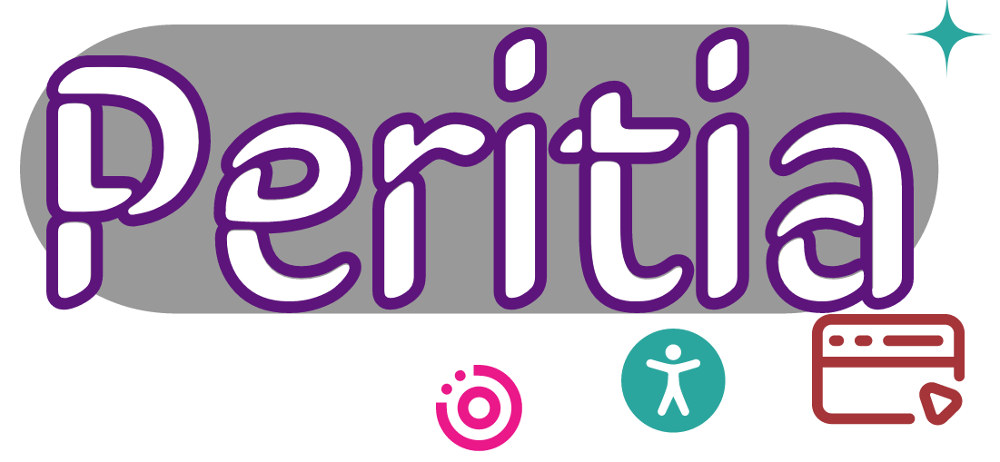

Peritia
==========

What is Peritia?
===================
**Peritia** is a powerful accessibility suite. Its clean user interface and feature-rich tools to help people with disabilities to access information,
communicate with others, and be productive without needing constant assistance.

Peritia includes several applications that  enhances the usability and accessibility of technology for eole with various disabilities. It can assist people who have visual, 
hearing, cognitive, or motor impairments to navigate and use technology with greater ease.

Here's a list of available tools that makes it the most versatile Accessibility suite:

.. image:: ./images/bigread.png
   :width: 100
   :alt: Peritia big read logo.

- ``BigRead`` *(Magnification tool designed to help people with visual impairments to see better by enlarging text and images on their comuter screen)*

.. image:: ./images/talkify.png
   :width: 100
   :alt: Peritia talkify logo.

- ``Talkify``

.. image:: ./images/textease.png
   :width: 100
   :alt: Peritia text ease logo.

- ``TextEase`` *(A text editor that prioritizes accessibility and is designed to make it easy for people with disabilities to create and edit text-based content with ease)*

.. note::

   Every image on our website contains alternative text for screen readers to provide text that is useful to someone who might not be able to see the image.

.. toctree::
   :maxdepth: 2
   :caption: Why

   summary
   introduction
   features
   installation

.. toctree::
   :caption: Miscellaneous pages
   
   team
   faq
   troubleshooting
   support.rst
   license.rst
   changes.rst
   appendix.rst

Donate🎁
--------------

In order to for us to maintain this project and grow our community of contributors.

`Donate <https://ko-fi.com/scalabli>`_

Getting Help
------------

Community
---------------

For discussions about the usage, development, and the future of quo, please join our Google community

`Community👨‍👩‍👦‍👦 <https://groups.google.com/g/scalabli>`_

Resources
-------------

Bug tracker
----------------

If you have any suggestions, bug reports, or annoyances please report them
to our issue tracker at `Bug tracker🪲️ <https://github.com/scalabli/peritia/issues/>`_ or send an email to:

 📥 scalabli@proton.me | scalabli@googlegroups.com

.. note::

   This project is under active development.
