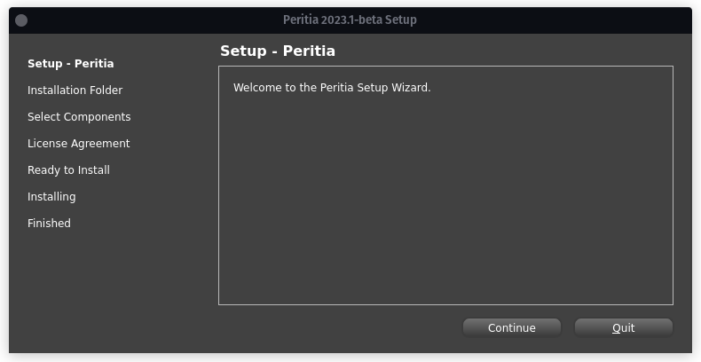
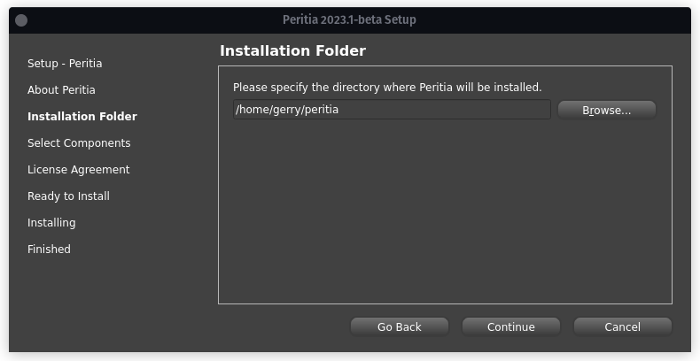
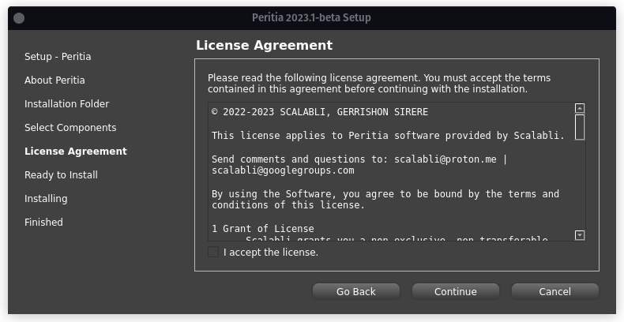
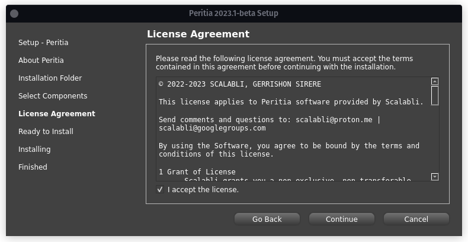
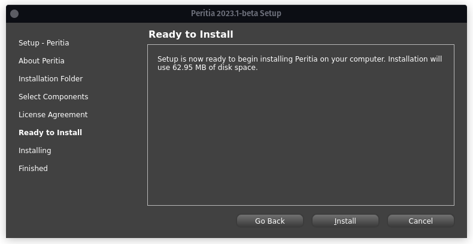
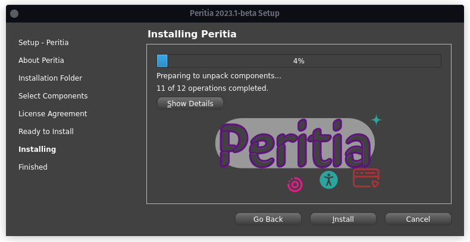
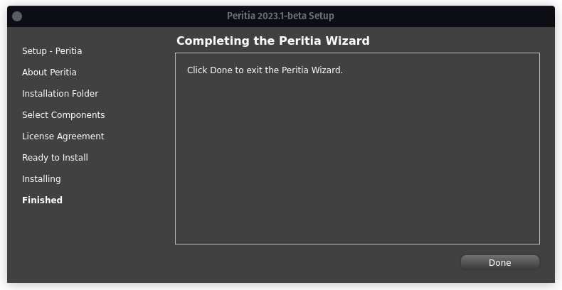

Installation
==============

Requirements
----------------

Linux OS
-----------
To use Peritia, first ensure you have libc6 version: >=2.35

Open the terminal and run this command to make the installation file you downloaded earlier and excecutable

.. code-block:: console

   chmod +x peritia.run

