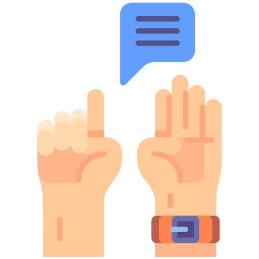
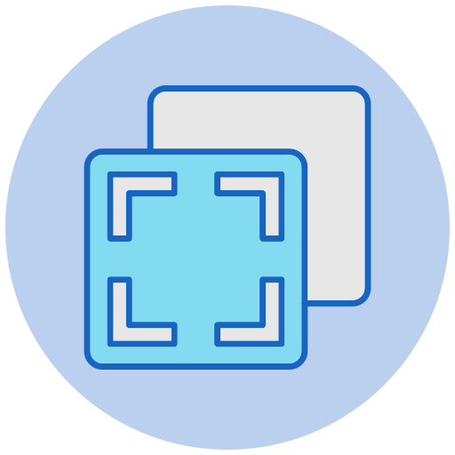

What is Peritia?
===================

At Peritia, we create several applications that enhances the usability and accessibility of technology for people with various disabilities. We have applications that can assist people who have visual, hearing, cognitive, motor impairments and neurodiverse disabilities to navigate and use technology with greater ease. Our mission is to break down barriers and improve accessibility for everyone. We believe that everyone deserves to live a full and independent life, and our software suite is designed to help people achieve that.

Peritia includes several applications that  enhances the usability and accessibility of technology for people with various disabilities. It can assist people who have visual, hearing, cognitive, motor impairments and neurodiverse disabilities to navigate and use technology with greater ease.

Here's a list of available tools that makes Peritia the most versatile Accessibility suite:

- ``Peritia ASL`` *(American Sign Language catalogue program that can help individuals learn and improve their American Sign Language skills. It features interactive signing instructions,a finger spelling tool and a search bar to search signs by word or by browsing through categories.)*

.. image:: ./images/aura.png
   :width: 100
   :alt: Peritia aura logo.

- ``Aura`` *(Cursor highlighting tool that is used to make the cursor more visible or distinguishable on a computer screen. Can be useful for individuals with visual impairments or for those using a computer in a brightly lit environment.)*

- ``BigRead`` *(Magnification tool designed to help people with visual impairments to see better by enlarging text and images on their computer screen)*

.. image:: ./images/sidekick.png
   :width: 100
   :alt: Peritia side kick logo.

- ``SideKick`` *(Software designed to provide you with accurate and up-to-date verbal information about your device's battery health, charge status, and time. It can also track your battery health over time by analyzing your charging habits and usage patterns, and provide you with verbal insights into how to optimize your device's battery life and improve its overall health. Useful for individuals with visual impairments or who prefer a spoken feedback instead.)*
 
.. image:: ./images/talkify.png
   :width: 100
   :alt: Peritia talkify logo.

- ``Talkify`` *(Text to speech software that can play written text as spoken words. Designed with people with disabilities in mind. Whether you have visual impairments, dyslexia, or any other disability that makes reading challenging, Talkify is here to help)*

.. image:: ./images/textease.png
   :width: 100
   :alt: Peritia text ease logo.

- ``TextEase`` *(Text editor that prioritizes accessibility.It allows users to write and edit text while receiving audio feedback in real-time while the user types. The editor will speak out loud each character that is inputted, allowing for a more immersive writing experience. Additionally, the editor may provide spoken suggestions for grammar or spelling errors. TextEase can be useful for people with visual impairments, as well as for anyone who prefers an audio-based approach to writing and editing.)*

.. image:: ./images/3dquest.png
   :width: 100
   :alt: Peritia three d quest logo.
- ``Neurolearn``  *(Designed to revolutionize the way we experience educational content. Neurolearn offers a captivating and immersive 3D environment where users can explore, learn and interact with objects. Neurolearn is tailored for individuals with neurodiverse disabilities and aims to provide an inclusive and accessible learning environment. Neurodiversity encompasses a range of conditions such as autism spectrum disorder (ASD), attention deficit hyperactivity disorder (ADHD), dyslexia, and other cognitive and developmental differences)*

- ``Blindsight`` *(By harnessing the power of computer vision and AI, Blindsight offers a comprehensive suite of features to dect and interpret images, objects and scenes in realtime. By simply pointing out their smartphone camera toards an object or document, users will receive instant audio feedack describing the items characteristics. It is useful for individuals with vision imppairment)*

In the coming months we will introduce *Version 2023.3* of Peritia Accessibility Suite. This release will introduce a range of new features and improvements aimed at providing a seamless user experience and increasing independence for our valued users.

What's New:

``Voice Command Capability``: We will integrate  a cutting-edge voice command feature across all Peritia applications. Users will be able to navigate, control, and interact with the suite using natural voice commands. This will empower individuals with motor impairments and those who prefer hands-free operation, enabling them to access information,and be productive without constant assistance.

``Expand ASL (American Sign Language) Software:`` Our ASL software will include an extensive library of new ASL words and phrases. This expansion will ensure that our users who communicate using sign language have access to a broader vocabulary, facilitating more effective communication and inclusivity.

``Enhanced User Interface:`` We have further refined the user interface of Peritia Accessibility Suite to provide a clean, intuitive, and user-friendly experience. The streamlined design aims to minimize cognitive load and make navigation effortless for individuals with cognitive impairments.

``Performance Enhancements and Bug Fixes:`` We are diligently working on improving the overall performance and stability of the suite. Several bugs identified are being addressed, ensuring a smoother experience across all applications.
