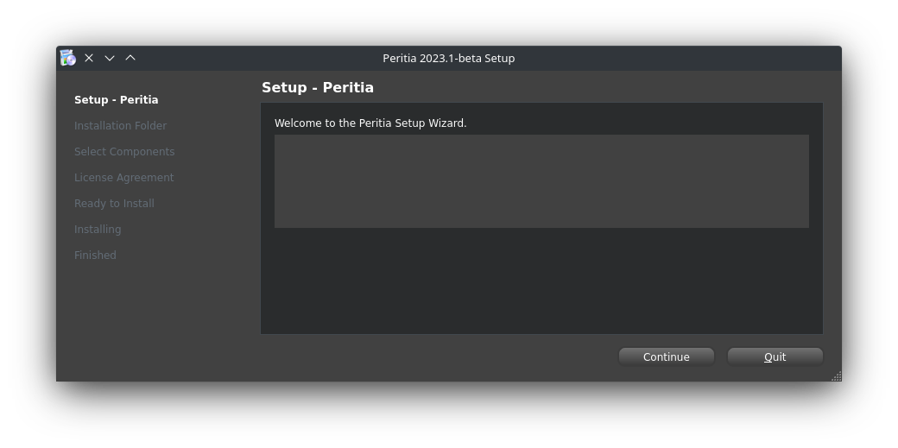
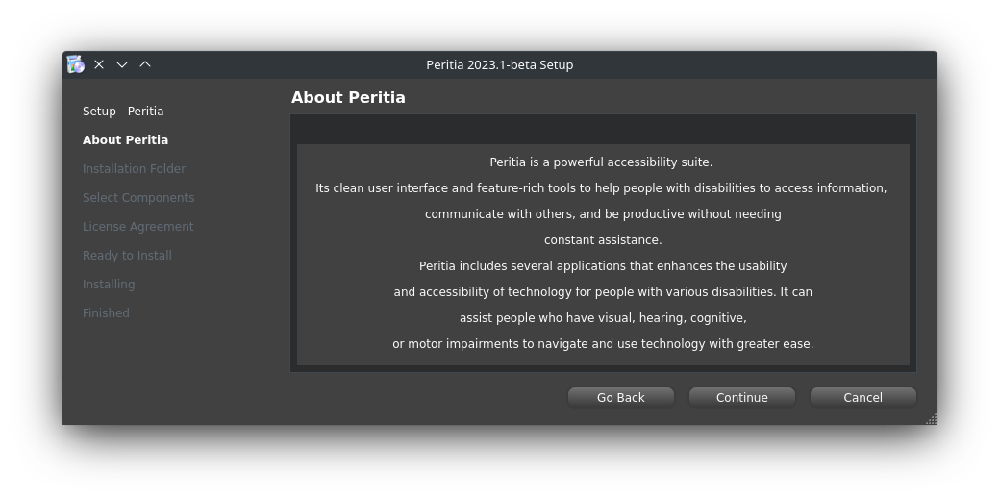
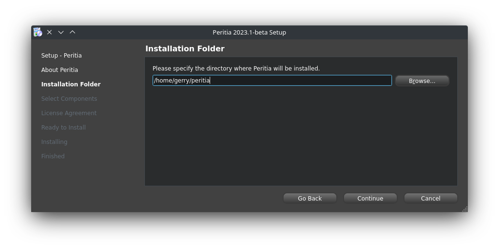
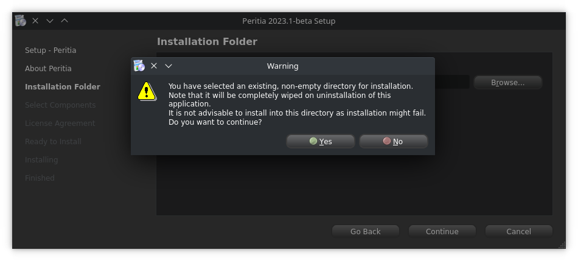
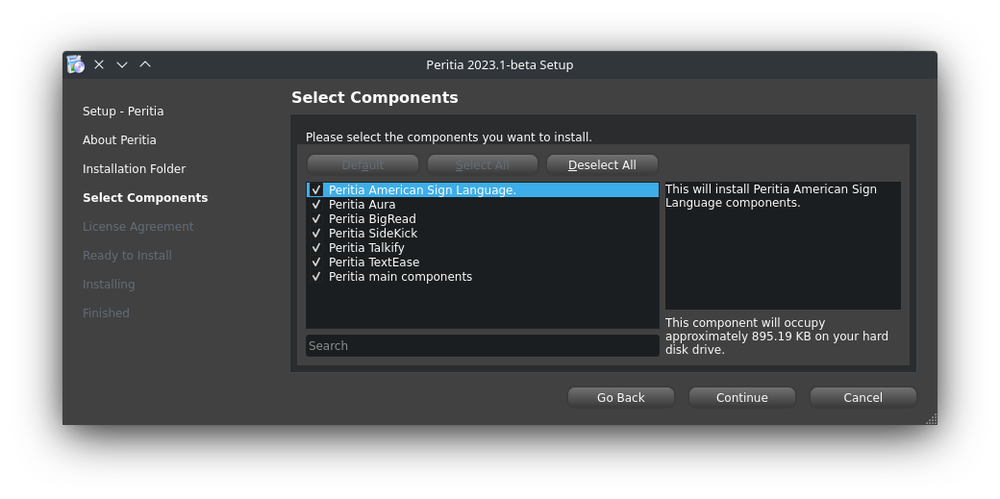
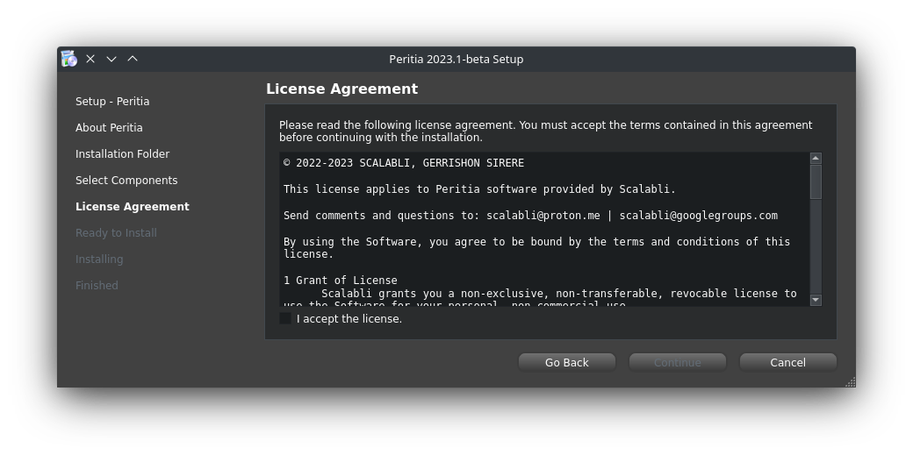
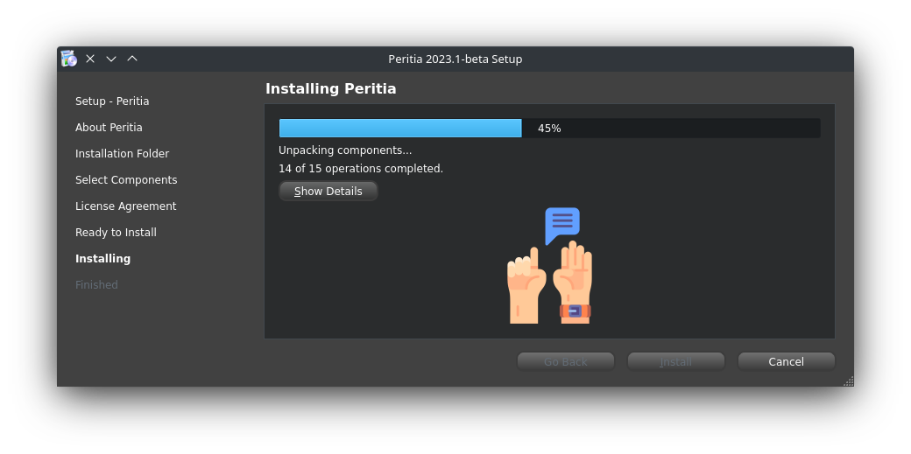

Windows
===========

.. image:: ./images/microsoft.png
   :width: 100
   :alt: Microsoft logo.

Before starting the installation process, check the System Requirements page for the prerequisites for installing Peritia on a Windows system.

Enterprise and government users: please check the deployment and migration information page.

You do not have to uninstall any previously installed version of Peritia. If you do have an existing installation of Peritia, all your preferences will be preserved
and that old installation will simply be overwritten.

Download
----------------
.. note::

   Peritia Accessibility Suite requires the 64-bit version of windows

If you are unsure which Windows version you have, press ⊞ Win+Pause to open your system properties window. 

Starting Installer
----------------------

Start the installer to open the introduction page opens and click next to read more about Peritia.

Select Continue, the target directory selection page opens.

Selecting Target Directory
--------------------------------

Specify the target directory for the installation or click continue to auto select  the default directory.
Select Continue, to open the component selection page.

If the directory you selected already contains files, a warning page will pop up.

Selecting Components
---------------------------

The component selection page lists the components available for installation and a short description of each component. Select the components to install.
You can select Select All to select all components, Deselect All to deselect them, or Default to revert to the default selection.

Select Continue, to open the license check page.

Accepting License Agreements
-----------------------------------

On the license check page, accept the terms of the license agreement for the installation to continue.

Installing Components
------------------------------

Select install to begin the installation process. During the installation, the perform installation page displays information about how the installation is progressing.
You can select Show Details to view more information.

